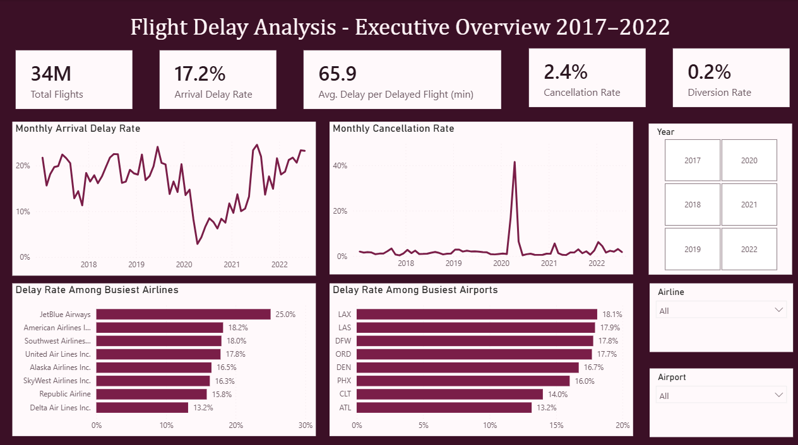
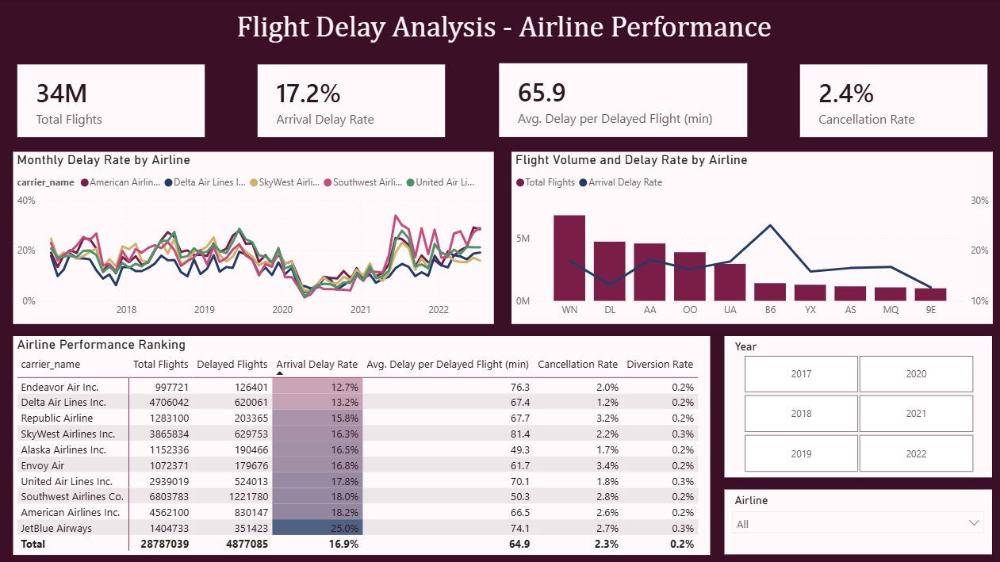
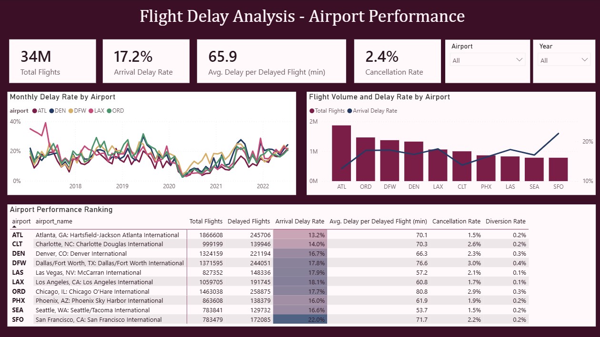
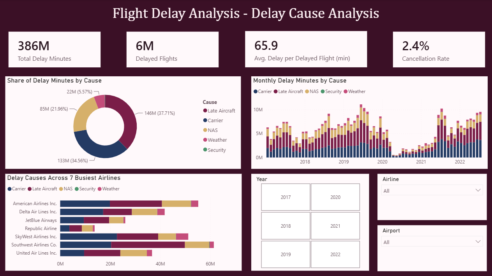

# Flight Delay Analysis Dashboard

An interactive Power BI dashboard analysing U.S. airline operations from **2017 to 2022**. The report covers flight volume, arrival delays, cancellations, diversions, airline and airport performance, and the contribution of different delay causes.

The dataset is aggregated by **year, month, airline, and airport**. It represents approximately **34 million arriving flights** rather than 34 million individual records.



## Dashboard summary

| Metric | Result |
|---|---:|
| Total arriving flights | 34M |
| Flights delayed by at least 15 minutes | 17.2% |
| Average delay per delayed flight | 65.9 minutes |
| Cancellation rate | 2.4% |
| Diversion rate | 0.2% |
| Total delay minutes | 386M |

## Report pages

### 1. Executive Overview

Tracks the main operational KPIs, monthly delay and cancellation trends, and delay-rate comparisons among the busiest airlines and airports.


### 2. Airline Performance

Compares monthly airline delay patterns, flight volume, arrival-delay rates, cancellation rates, diversion rates, and average delay duration. The ranking table uses conditional formatting to make differences easier to identify.



### 3. Airport Performance

Examines the busiest airports using monthly trends, flight-volume comparisons, delay rates, cancellations, diversions, and an airport-level performance ranking.



### 4. Delay Cause Analysis

Breaks total delay minutes into five reported causes:

- Carrier
- Late-arriving aircraft
- National Airspace System (NAS)
- Weather
- Security



## Key findings

- **17.2%** of arriving flights were delayed by at least 15 minutes.
- A delayed flight accumulated an average of **65.9 minutes** of delay.
- **Late-arriving aircraft** accounted for the largest share of delay minutes at approximately **146M minutes (37.7%)**.
- **Carrier-related delays** followed at approximately **133M minutes (34.6%)**.
- NAS-related delays contributed approximately **85M minutes (22.0%)**.
- The cancellation trend shows a pronounced disruption during **2020**.
- Among the busiest airlines displayed, **JetBlue Airways** recorded the highest overall arrival-delay rate, while **Delta Air Lines** recorded the lowest.
- Among the busiest airports displayed, **San Francisco International Airport (SFO)** recorded the highest overall arrival-delay rate, while **Hartsfield-Jackson Atlanta International Airport (ATL)** recorded the lowest.

## Tools and techniques

- Power BI Desktop
- Power Query
- DAX
- Data modelling
- KPI design
- Time-series visualisation
- Conditional formatting
- Interactive slicers and tooltips
- Custom Power BI theme

## Data model

The main `airline` table contains monthly airline-airport aggregates. A disconnected `Delay Causes` table is used with a `SWITCH` measure to display multiple delay-cause measures through one legend.

The report also uses a calculated `MonthDate` column to support chronological monthly analysis.

Full measure definitions are documented in [`docs/dax-measures.md`](docs/dax-measures.md).

## Data source

The project uses the **U.S. Department of Transportation, Bureau of Transportation Statistics (BTS) Airline On-Time Statistics and Delay Causes** data.

The repository does not redistribute the raw source files. Source notes and the field dictionary are available in [`data/README.md`](data/README.md).

## Repository structure

```text
flight-delay-analysis-dashboard/
├── README.md
├── flight-delay-analysis-dashboard.pbix
├── data/
│   └── README.md
├── docs/
│   ├── dax-measures.md
├── screenshots/
│   ├── 01-executive-overview.png
│   ├── 02-airline-performance.png
│   ├── 03-airport-performance.png
│   └── 04-delay-cause-analysis.png
└── theme/
    └── aviation-burgundy-hybrid-theme.json
```

## Open the report

1. Download or clone this repository.
2. Open `flight-delay-analysis-dashboard.pbix` in Power BI Desktop.
3. Use the Year, Airline, and Airport slicers to explore the report.
4. Clear all slicers to return to the full 2017–2022 view.

## Scope and limitations

- The data is aggregated monthly and does not contain individual flight numbers or route-level origin-destination records.
- The report therefore does not analyse time-of-day performance, individual routes, or specific flights.
- Results describe the reporting carriers and airports represented in the BTS source data for 2017–2022.
- The 2020 period should be interpreted in the context of the major operational disruption visible in flight volumes and cancellations.
